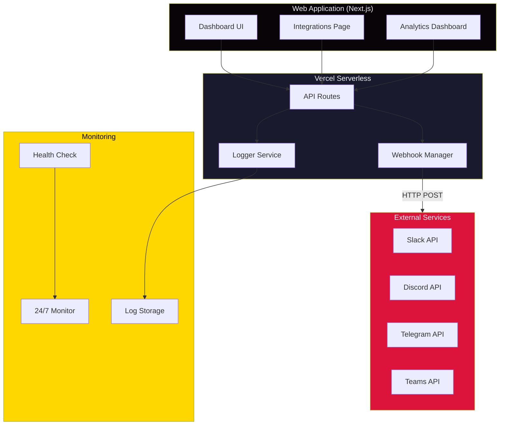
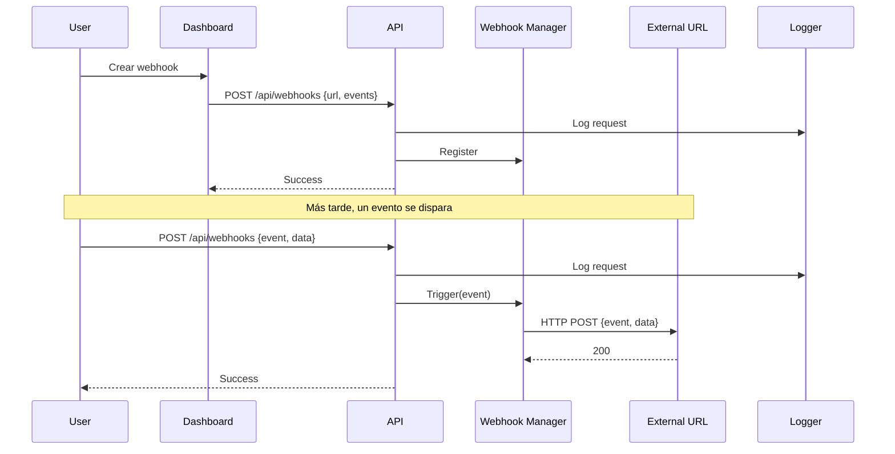
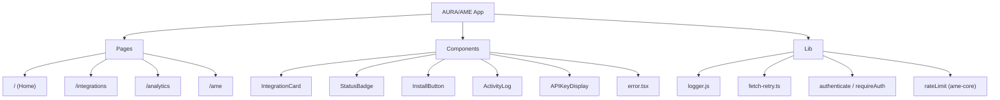
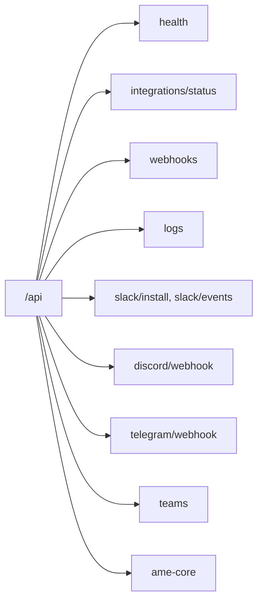
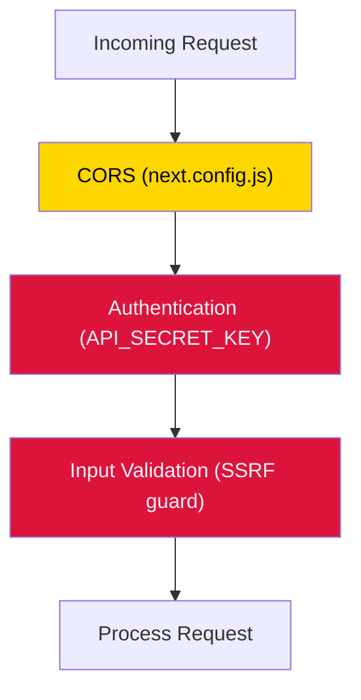
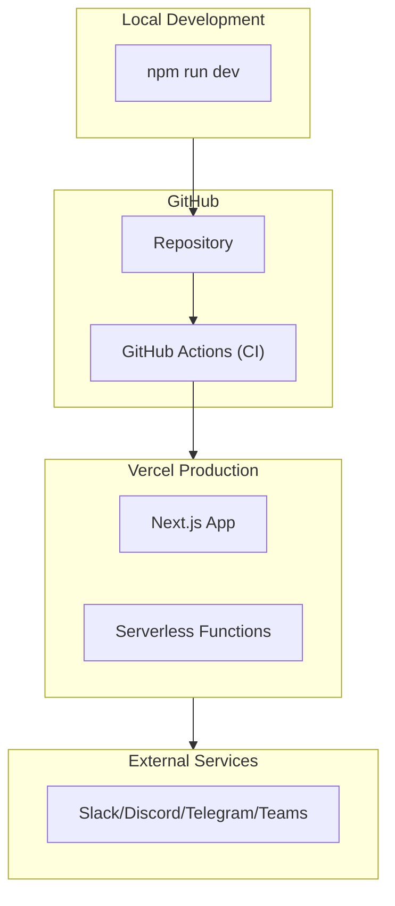

# AURA/AME v3.0 — Architecture Overview

> Diagramas de arquitectura (Mermaid). La app web v3.0 está completa; las
> cajas marcadas "Phase 58" corresponden al trabajo futuro de Cline.

## System Diagram

## Data Flow (webhook trigger)

## Component Hierarchy

## API Endpoints

## Security Layer

> **Nota:** el rate limiting (`lib/rateLimit.ts`) está aplicado solo en
> `ame-core` en v3.0; ver `MEJORAS-FASE-57.md` para el plan de extenderlo.

## Deployment Architecture

