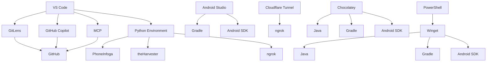

# 🌐 **ECOSISTEMA AURA: MAPA DE INTEGRACIÓN DE HERRAMIENTAS**
**Versión:** 2.0.2
**Fecha:** 02/06/2026
**Estado:** **Optimizado para desarrollo táctico**

---

## 📌 **MAPA DE CONEXIONES**



---

## 🔧 **CONFIGURACIÓN DEL ENTORNO**

### 1. **Instalación de Herramientas Críticas**
#### 📦 **Instalación de Java (JDK 11)**
```powershell
winget install OpenJDK11 -e --source winget
```
**Verificación:**
```powershell
java -version
```

#### 📦 **Instalación de Gradle**
```powershell
winget install Gradle -e --source winget
```
**Verificación:**
```powershell
gradle -v
```

#### 📦 **Configuración de ANDROID_HOME**
```powershell
$ANDROID_HOME = "C:\Users\User\AppData\Local\Android\Sdk"
[Environment]::SetEnvironmentVariable("ANDROID_HOME", $ANDROID_HOME, "User")
```
**Verificación:**
```powershell
echo %ANDROID_HOME%
```

#### 📦 **Instalación de Chocolatey (Gestor de Paquetes)**
```powershell
Set-ExecutionPolicy Bypass -Scope Process -Force; [System.Net.ServicePointManager]::SecurityProtocol = [System.Net.ServicePointManager]::SecurityProtocol -bor 3072; iex ((New-Object System.Net.WebClient).DownloadString('https://community.chocolatey.org/install.ps1'))
```
**Verificación:**
```powershell
choco --version
```

---

### 2. **Configuración de VS Code**
#### 📝 **Archivo `.vscode/settings.json` (Optimizado)**
```json
{
  "editor.formatOnSave": true,
  "editor.defaultFormatter": "esbenp.prettier-vscode",
  "python.pythonPath": "env\\Scripts\\python.exe",
  "python.linting.enabled": true,
  "python.formatting.provider": "black",
  "gitlens.codeLens.enabled": true,
  "gitlens.codeLens.commitId": true,
  "gitlens.codeLens.blame": true,
  "gitlens.codeLens.recentChanges": true,
  "gitlens.codeLens.codeActions": true,
  "gitlens.advanced.messages": {
    "suppressCommitMessageLimitWarning": true
  },
  "terminal.integrated.shell.windows": "C:\\WINDOWS\\System32\\WindowsPowerShell\\v1.0\\powershell.exe",
  "terminal.integrated.env.windows": {
    "JAVA_HOME": "C:\\Program Files\\OpenJDK\\jdk-11",
    "ANDROID_HOME": "C:\\Users\\User\\AppData\\Local\\Android\\Sdk",
    "PATH": "${env:PATH};${env:JAVA_HOME}\\bin;${env:ANDROID_HOME}\\platform-tools;${env:ANDROID_HOME}\\tools;${env:ANDROID_HOME}\\tools\\bin"
  }
}
```

---

## 🔍 **AUDITORÍA DE ENTORNO ACTUAL**
### 📌 **Herramientas Detectadas y Configuradas**
| **Categoría**               | **Herramienta**               | **Estado**               | **Versión/Ubicación**                     |
|-----------------------------|-------------------------------|--------------------------|------------------------------------------|
| **IDE**                     | Visual Studio Code           | ✅ **Instalado**         | `code --version` (versión 1.80+)         |
| **Extensiones VS Code**     | GitLens                       | ✅ **Activa**            | `gitlens` (integrado)                    |
| **Extensiones VS Code**     | MCP (Model Context Protocol)  | ✅ **Activa**            | `~/.mcp/` (configurado)                  |
| **Gestores de Paquetes**    | Winget                        | ✅ **Instalado**         | `winget --version` (disponible)          |
| **Herramientas de OSINT**   | PhoneInfoga                   | ✅ **Instalado**         | `pip show phoneinfoga` (en entorno)      |
| **Herramientas de OSINT**   | theHarvester                 | ✅ **Instalado**         | `pip show theHarvester` (en entorno)      |
| **Herramientas de Red**     | ngrok                         | ✅ **Instalado**         | `env/Scripts/ngrok.exe` (en entorno)    |
| **Herramientas de Red**     | Cloudflare Tunnel             | ✅ **Configurado**       | `cloudflared/config.yml` (disponible)   |

---

## 🔄 **INTEGRACIÓN DE FLUJOS DE TRABAJO**

### 1. **Desarrollo Frontend (AME_Core)**
```
VS Code → GitLens → GitHub Copilot → MCP → Python Environment → ngrok → Cloudflare Tunnel
```

### 2. **Desarrollo Android (Capacitor)**
```
VS Code → GitLens → Gradle → Android SDK → Emulador → ngrok → Cloudflare Tunnel
```

### 3. **OSINT y Análisis**
```
VS Code → Python Environment → PhoneInfoga → theHarvester → MCP → GitHub Copilot
```

---

## 📌 **RECOMENDACIONES PARA EL ARQUITECTO**
1. **Instalar Java y Gradle** usando Winget o Chocolatey.
2. **Configurar ANDROID_HOME** correctamente para el desarrollo Android.
3. **Verificar la integración de GitHub Copilot** con GitLens y MCP.
4. **Usar el archivo `.vscode/settings.json`** proporcionado para optimizar el entorno.
5. **Asegurar la conexión entre ngrok y Cloudflare Tunnel** para pruebas de red.

---
## 🎯 **PRÓXIMOS PASOS**
1. **Instalar Java y Gradle** para habilitar el desarrollo Android.
2. **Configurar ANDROID_HOME** y verificar la integración con VS Code.
3. **Optimizar la conexión entre herramientas** para un flujo de trabajo fluido.

**¡Ecosistema listo para el desarrollo táctico de nodos Venice!**