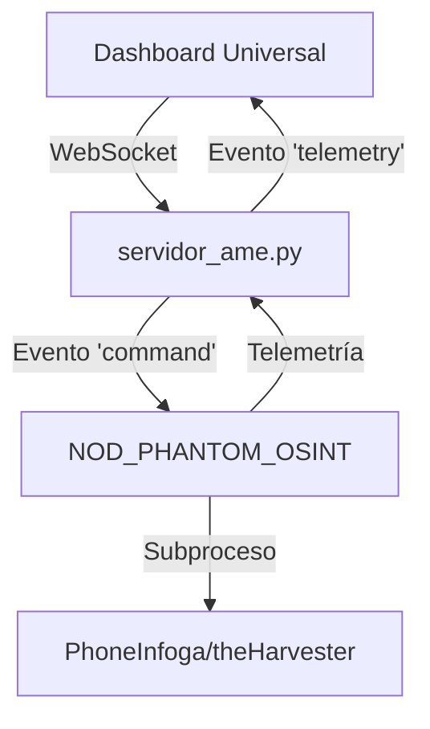

# 📜 **PROPUESTA TÉCNICA: NODO PHANTOM OSINT**
**Versión:** 1.0.0
**Fecha:** 02/06/2026
**Estado:** **Propuesta Inicial**
**Autor:** Arquitecto de Software Senior

---

## 🎯 **Objetivo General**
Desarrollar un nodo **NOD_PHANTOM_OSINT** que actúe como motor de ejecución automatizada para herramientas OSINT locales (PhoneInfoga, theHarvester), capaz de:
1. Recibir parámetros de búsqueda desde el backend.
2. Ejecutar herramientas OSINT de manera asíncrona y no bloqueante.
3. Enviar resultados estructurados (JSON) al dashboard en tiempo real mediante WebSocket.
4. Manejar errores y excepciones de manera resiliente sin afectar el sistema principal.

---

## 🔍 **Análisis de Contexto**
### **1. Dependencias y Componentes Existentes**
| **Componente**               | **Ubicación**                     | **Descripción**                                                                                     |
|------------------------------|-----------------------------------|-------------------------------------------------------------------------------------------------|
| `servidor_ame.py`           | `AME_Core/`                       | Servidor principal con WebSocket (SocketIO) y endpoints REST.                                       |
| `PhoneInfoga`                | Entorno virtual (`env/`)          | Herramienta OSINT para recolección de información de teléfonos.                                    |
| `theHarvester`              | Entorno virtual (`env/`)          | Herramienta OSINT para recolección de información pública.                                        |
| `SocketIO`                   | `AME_Core/servidor_ame.py`       | Infraestructura de WebSocket para comunicación en tiempo real.                                      |
| `Shadow-Core/nodes/`         | `Shadow-Core/`                    | Directorio para nodos existentes (ejemplo: `NOD_WIFI_DEAUTH.py`).                                   |

### **2. Restricciones Técnicas (Constraints)**
| **Constraint**               | **Descripción**                                                                                     |
|------------------------------|-------------------------------------------------------------------------------------------------|
| **Asincronía**               | Ejecución no bloqueante de herramientas OSINT.                                                    |
| **Telemetría en Tiempo Real**| Comunicación bidireccional con el dashboard mediante WebSocket.                                   |
| **Resiliencia**              | Manejo de errores y excepciones sin afectar el sistema principal.                                  |
| **Entorno Restringido**     | Uso exclusivo del entorno virtual `env/` y herramientas instaladas localmente.                     |
| **Integración con MCP**      | Compatibilidad con el protocolo MCP para comunicación avanzada.                                   |

---

## 📋 **Propuesta de Arquitectura**
### **1. Diagrama de Componentes**

### **2. Flujo de Trabajo**
1. **Recepción de Comando:**
   - El dashboard envía un evento `command` con parámetros de búsqueda al servidor (`servidor_ame.py`).
   - El servidor redirige el comando al nodo `NOD_PHANTOM_OSINT`.

2. **Ejecución Asíncrona:**
   - El nodo ejecuta herramientas OSINT (PhoneInfoga/theHarvester) en segundo plano.
   - Emite eventos de telemetría (`iniciando`, `procesando`, `finalizado`) al servidor.

3. **Resultado y Telemetría:**
   - El servidor envía los resultados y eventos de telemetría al dashboard mediante WebSocket.

---

## 📝 **Especificaciones Técnicas (OpenSpec)**
### **1. Requisitos Funcionales**
| **ID**  | **Descripción**                                                                                     | **Prioridad** |
|---------|-------------------------------------------------------------------------------------------------|---------------|
| RF-001  | El nodo debe recibir comandos desde `servidor_ame.py` mediante WebSocket.                       | Alta          |
| RF-002  | Ejecutar herramientas OSINT (PhoneInfoga/theHarvester) de manera asíncrona.                     | Alta          |
| RF-003  | Emitir eventos de telemetría en tiempo real al dashboard.                                       | Alta          |
| RF-004  | Manejar errores y excepciones sin afectar el sistema principal.                                  | Crítica       |
| RF-005  | Retornar resultados estructurados en formato JSON.                                                 | Alta          |

### **2. Requisitos No Funcionales**
| **ID**  | **Descripción**                                                                                     | **Prioridad** |
|---------|-------------------------------------------------------------------------------------------------|---------------|
| RNF-001 | Ejecución no bloqueante (uso de `asyncio` o `subprocess`).                                         | Crítica       |
| RNF-002 | Latencia máxima de 5 segundos para eventos de telemetría.                                         | Alta          |
| RNF-003 | Compatibilidad con herramientas OSINT instaladas en el entorno virtual (`env/`).                   | Alta          |
| RNF-004 | Uso exclusivo de WebSocket para comunicación con el dashboard.                                    | Alta          |

---

## 🎯 **Criterios de Aceptación**
### **1. Casos de Éxito (GIVEN/WHEN/THEN)**
| **ID**  | **Escenario**                                                                                     | **Criterio de Aceptación**                                                                         |
|---------|-------------------------------------------------------------------------------------------------|---------------------------------------------------------------------------------------------------|
| CA-001  | **GIVEN** un comando OSINT válido, **WHEN** el nodo recibe el comando, **THEN** debe iniciar la ejecución asíncrona. | El nodo emite un evento `telemetry` con estado `iniciando` y ejecuta la herramienta OSINT.     |
| CA-002  | **GIVEN** una herramienta OSINT en ejecución, **WHEN** se completan los resultados, **THEN** debe emitir un evento `telemetry` con estado `finalizado` y los datos estructurados. | El dashboard recibe los resultados en formato JSON y actualiza la interfaz.                        |
| CA-003  | **GIVEN** un error en la ejecución de una herramienta OSINT, **WHEN** ocurre la excepción, **THEN** debe emitir un evento `telemetry` con estado `error` y detalles del error. | El dashboard muestra el error sin afectar el sistema principal.                                    |

### **2. Casos de Error (GIVEN/WHEN/THEN)**
| **ID**  | **Escenario**                                                                                     | **Criterio de Aceptación**                                                                         |
|---------|-------------------------------------------------------------------------------------------------|---------------------------------------------------------------------------------------------------|
| CE-001  | **GIVEN** una herramienta OSINT no instalada, **WHEN** el nodo intenta ejecutarla, **THEN** debe emitir un evento `telemetry` con estado `error` y mensaje descriptivo. | El dashboard muestra un mensaje claro sobre la herramienta faltante.                              |
| CE-002  | **GIVEN** un timeout en la ejecución de una herramienta OSINT, **WHEN** el proceso supera los 300 segundos, **THEN** debe cancelar la ejecución y emitir un evento `telemetry` con estado `timeout`. | El dashboard muestra un mensaje de timeout y permite reiniciar la tarea.                          |
| CE-003  | **GIVEN** un comando OSINT inválido, **WHEN** el nodo recibe el comando, **THEN** debe emitir un evento `telemetry` con estado `error` y detalles del comando inválido. | El dashboard muestra un mensaje de error y no inicia la ejecución.                                |

---

## 🚫 **Non-Goals (Fuera de Alcance)**
| **ID**  | **Descripción**                                                                                     |
|---------|-------------------------------------------------------------------------------------------------|
| NG-001  | Implementación de autenticación avanzada en el nodo.                                               |
| NG-002  | Soporte para herramientas OSINT externas no instaladas en el entorno virtual (`env/`).              |
| NG-003  | Integración con bases de datos externas o APIs de terceros.                                        |
| NG-004  | Desarrollo de una interfaz gráfica para el nodo.                                                   |
| NG-005  | Implementación de mecanismos de persistencia de datos más allá de la memoria del proceso.         |

---

## 📌 **Próximos Pasos**
1. **Revisión y Aprobación:** Validar la propuesta técnica con el Arquitecto.
2. **Generación de Especificaciones Detalladas:** Crear el documento `specs.md` con los escenarios GIVEN/WHEN/THEN y criterios de aceptación.
3. **Diseño de Tareas:** Dividir la implementación en unidades de trabajo atómicas (tasks.md).

**¡Listo para la revisión y aprobación!**