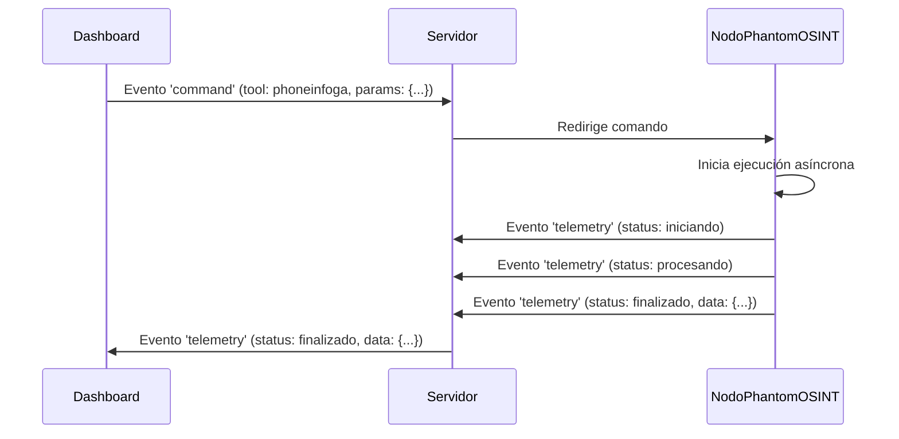

# 📜 **ESPECIFICACIONES TÉCNICAS DETALLADAS: NODO PHANTOM OSINT**
**Versión:** 1.0.0
**Fecha:** 02/06/2026
**Estado:** **Especificación Técnica**
**Autor:** Arquitecto de Software Senior

---

## 🎯 **Objetivo**
Definir las especificaciones técnicas detalladas para el desarrollo del nodo **NOD_PHANTOM_OSINT**, incluyendo:
- **Estructura del código**.
- **Comunicación con el servidor**.
- **Manejo de herramientas OSINT**.
- **Telemetría y eventos**.
- **Manejo de errores y excepciones**.

---

## 📋 **Estructura del Nodo**
### **1. Directorio y Archivos**
| **Archivo**                     | **Ubicación**                     | **Descripción**                                                                                     |
|---------------------------------|-----------------------------------|-------------------------------------------------------------------------------------------------|
| `NOD_PHANTOM_OSINT.py`          | `Shadow-Core/nodes/`             | Implementación principal del nodo.                                                               |
| `tests/`                        | `Shadow-Core/nodes/NOD_PHANTOM_OSINT/` | Pruebas unitarias y de integración.                                                           |

### **2. Estructura del Código**
```python
# Shadow-Core/nodes/NOD_PHANTOM_OSINT.py
class PhantomOSINTNode:
    def __init__(self, config):
        """Inicializa el nodo con la configuración proporcionada."""
        self.config = config
        self.logger = config.get('logger', None)
        self.tools = {
            'phoneinfoga': self._execute_phoneinfoga,
            'theharvester': self._execute_theharvester
        }

    def start(self, command):
        """Inicia la ejecución del nodo con el comando proporcionado."""
        pass

    def _execute_phoneinfoga(self, params):
        """Ejecuta PhoneInfoga con los parámetros proporcionados."""
        pass

    def _execute_theharvester(self, params):
        """Ejecuta theHarvester con los parámetros proporcionados."""
        pass

    def _emit_telemetry(self, event_type, data):
        """Emite un evento de telemetría al servidor."""
        pass

    def _handle_error(self, error):
        """Maneja errores y excepciones de manera resiliente."""
        pass
```

---

## 🔧 **Comunicación con el Servidor**
### **1. Eventos WebSocket**
| **Evento**       | **Descripción**                                                                                     | **Estructura del Payload**                                                                         |
|------------------|-------------------------------------------------------------------------------------------------|---------------------------------------------------------------------------------------------------|
| `command`        | Comando recibido del servidor para iniciar una tarea OSINT.                                        | `{ "tool": "phoneinfoga", "params": { "target": "1234567890" }, "node_id": "NOD_PHANTOM_OSINT" }` |
| `telemetry`      | Evento emitido por el nodo para notificar el estado de la tarea.                                | `{ "status": "iniciando|procesando|finalizado|error", "data": {...}, "node_id": "NOD_PHANTOM_OSINT" }`     |

### **2. Ejemplo de Flujo de Comunicación**


---

## 🛠 **Herramientas OSINT**
### **1. Parámetros de Entrada**
| **Herramienta**   | **Parámetros Obligatorios**       | **Parámetros Opcionales**                     | **Ejemplo de Uso**                                                                                     |
|-------------------|-----------------------------------|-----------------------------------------------|---------------------------------------------------------------------------------------------------|
| PhoneInfoga       | `target` (número de teléfono)    | `output_format`, `timeout`                   | `{ "target": "1234567890", "output_format": "json" }`                                               |
| theHarvester     | `domain` (dominio)               | `limit`, `source`, `quiet`                   | `{ "domain": "ejemplo.com", "limit": 100, "source": "all" }`                                          |

### **2. Salida Estructurada (JSON)**
```json
{
  "tool": "phoneinfoga",
  "status": "success",
  "target": "1234567890",
  "results": {
    "phone_number": "1234567890",
    "carrier": "Claro",
    "location": "Lima, Perú",
    "email": ["user@example.com"],
    "social_media": {
      "facebook": "https://facebook.com/user",
      "twitter": "https://twitter.com/user"
    }
  },
  "timestamp": "2026-06-02T16:00:00Z"
}
```

---

## 📡 **Telemetría y Eventos**
### **1. Tipos de Eventos**
| **Estado**         | **Descripción**                                                                                     | **Payload Ejemplo**                                                                                 |
|--------------------|-------------------------------------------------------------------------------------------------|---------------------------------------------------------------------------------------------------|
| `iniciando`        | El nodo ha recibido el comando y está iniciando la ejecución.                                     | `{ "status": "iniciando", "tool": "phoneinfoga", "target": "1234567890" }`                        |
| `procesando`       | La herramienta OSINT está en ejecución.                                                          | `{ "status": "procesando", "progress": 50, "tool": "phoneinfoga" }`                                |
| `finalizado`       | La ejecución se completó con éxito.                                                              | `{ "status": "finalizado", "data": {...}, "tool": "phoneinfoga" }`                                   |
| `error`            | Ocurrió un error durante la ejecución.                                                           | `{ "status": "error", "message": "Herramienta no instalada", "tool": "phoneinfoga" }`              |
| `timeout`          | La ejecución superó el tiempo máximo permitido (300 segundos).                                   | `{ "status": "timeout", "tool": "phoneinfoga", "target": "1234567890" }`                            |

---

## ⚠ **Manejo de Errores y Excepciones**
### **1. Casos de Error**
| **Error**                          | **Descripción**                                                                                     | **Acción del Nodo**                                                                                  |
|-----------------------------------|-------------------------------------------------------------------------------------------------|---------------------------------------------------------------------------------------------------|
| Herramienta no instalada          | La herramienta OSINT no está disponible en el entorno virtual.                                  | Emite evento `telemetry` con estado `error` y mensaje descriptivo.                                  |
| Comando inválido                 | Parámetros de entrada no válidos o faltantes.                                                     | Emite evento `telemetry` con estado `error` y detalles del comando inválido.                       |
| Timeout                           | La ejecución supera los 300 segundos.                                                            | Cancela la ejecución y emite evento `telemetry` con estado `timeout`.                                |
| Excepción inesperada             | Error interno en la ejecución de la herramienta.                                                  | Emite evento `telemetry` con estado `error` y traza de la excepción.                                |

### **2. Ejemplo de Manejo de Error**
```python
def _execute_phoneinfoga(self, params):
    try:
        # Validar parámetros
        if 'target' not in params:
            self._emit_telemetry('error', {
                'message': 'Parámetro "target" es obligatorio para PhoneInfoga.',
                'tool': 'phoneinfoga'
            })
            return

        # Ejecutar herramienta
        result = subprocess.run(
            ['phoneinfoga', '--json', params['target']],
            capture_output=True,
            text=True,
            timeout=300
        )

        if result.returncode != 0:
            self._emit_telemetry('error', {
                'message': f'Error al ejecutar PhoneInfoga: {result.stderr}',
                'tool': 'phoneinfoga'
            })
            return

        # Procesar resultados
        data = json.loads(result.stdout)
        self._emit_telemetry('finalizado', {
            'data': data,
            'tool': 'phoneinfoga'
        })

    except subprocess.TimeoutExpired:
        self._emit_telemetry('timeout', {
            'message': 'Timeout al ejecutar PhoneInfoga (300 segundos).',
            'tool': 'phoneinfoga'
        })
    except Exception as e:
        self._emit_telemetry('error', {
            'message': f'Excepción inesperada: {str(e)}',
            'tool': 'phoneinfoga'
        })
```

---

## 🧪 **Pruebas y Validación**
### **1. Pruebas Unitarias**
| **Prueba**                          | **Descripción**                                                                                     | **Resultado Esperado**                                                                              |
|-----------------------------------|-------------------------------------------------------------------------------------------------|---------------------------------------------------------------------------------------------------|
| `test_init_node`                  | Verifica la inicialización del nodo con configuración válida.                                    | El nodo se inicializa correctamente sin errores.                                                  |
| `test_execute_phoneinfoga_success`| Verifica la ejecución exitosa de PhoneInfoga con parámetros válidos.                              | El nodo emite un evento `telemetry` con estado `finalizado` y datos estructurados.              |
| `test_execute_phoneinfoga_error`  | Verifica el manejo de errores al ejecutar PhoneInfoga con parámetros inválidos.                   | El nodo emite un evento `telemetry` con estado `error` y mensaje descriptivo.                       |
| `test_execute_timeout`            | Verifica el manejo de timeout al ejecutar una herramienta OSINT.                                | El nodo emite un evento `telemetry` con estado `timeout`.                                           |

### **2. Pruebas de Integración**
| **Prueba**                          | **Descripción**                                                                                     | **Resultado Esperado**                                                                              |
|-----------------------------------|-------------------------------------------------------------------------------------------------|---------------------------------------------------------------------------------------------------|
| `test_integration_websocket`      | Verifica la comunicación bidireccional entre el nodo y el servidor mediante WebSocket.             | El servidor recibe eventos `telemetry` del nodo y los reenvía al dashboard.                        |
| `test_integration_tools`          | Verifica la ejecución de herramientas OSINT en el entorno virtual.                               | Las herramientas se ejecutan correctamente y retornan datos estructurados.                      |

---

## 📌 **Criterios de Aceptación Final**
### **1. Casos de Éxito**
| **ID**  | **Escenario**                                                                                     | **Criterio de Aceptación**                                                                         |
|---------|-------------------------------------------------------------------------------------------------|---------------------------------------------------------------------------------------------------|
| CA-001  | **GIVEN** un comando OSINT válido, **WHEN** el nodo recibe el comando, **THEN** debe iniciar la ejecución asíncrona y emitir un evento `telemetry` con estado `iniciando`. | El dashboard muestra el estado `iniciando` y el nodo ejecuta la herramienta OSINT en segundo plano. |
| CA-002  | **GIVEN** una herramienta OSINT en ejecución, **WHEN** se completan los resultados, **THEN** debe emitir un evento `telemetry` con estado `finalizado` y los datos estructurados. | El dashboard recibe los resultados en formato JSON y actualiza la interfaz correctamente.         |
| CA-003  | **GIVEN** un error en la ejecución de una herramienta OSINT, **WHEN** ocurre la excepción, **THEN** debe emitir un evento `telemetry` con estado `error` y detalles del error. | El dashboard muestra el error sin afectar el sistema principal.                                    |

### **2. Casos de Error**
| **ID**  | **Escenario**                                                                                     | **Criterio de Aceptación**                                                                         |
|---------|-------------------------------------------------------------------------------------------------|---------------------------------------------------------------------------------------------------|
| CE-001  | **GIVEN** una herramienta OSINT no instalada, **WHEN** el nodo intenta ejecutarla, **THEN** debe emitir un evento `telemetry` con estado `error` y mensaje descriptivo. | El dashboard muestra un mensaje claro sobre la herramienta faltante.                              |
| CE-002  | **GIVEN** un timeout en la ejecución de una herramienta OSINT, **WHEN** el proceso supera los 300 segundos, **THEN** debe cancelar la ejecución y emitir un evento `telemetry` con estado `timeout`. | El dashboard muestra un mensaje de timeout y permite reiniciar la tarea.                          |
| CE-003  | **GIVEN** un comando OSINT inválido, **WHEN** el nodo recibe el comando, **THEN** debe emitir un evento `telemetry` con estado `error` y detalles del comando inválido. | El dashboard muestra un mensaje de error y no inicia la ejecución.                                |

---

## 📌 **Próximos Pasos**
1. **Revisión y Aprobación:** Validar las especificaciones técnicas con el Arquitecto.
2. **Diseño de Tareas:** Dividir la implementación en unidades de trabajo atómicas (tasks.md).
3. **Implementación:** Aplicar Strict TDD (Test-Driven Development) para cada tarea.

**¡Listo para la revisión y aprobación!**