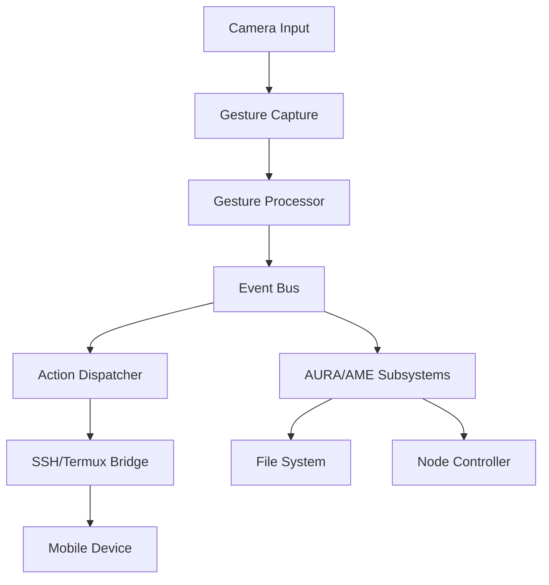

# 📜 **SPECIFICATIONS: GESTURE INPUT BRIDGE (GIB)**
## **Gesture Control System for AURA/AME**
**Version:** 1.0.0
**Date:** 02/06/2026
**Status:** Proposal & Specifications
**Author:** System Architect

---

## 🎯 **Objective**
Design a **Gesture Input Bridge (GIB)** that captures real-time video from a camera (PC or mobile), processes basic hand gestures using **MediaPipe**, and translates them into system events or commands for controlling AURA/AME nodes and file operations. The system will use an **event-driven architecture** to ensure minimal latency and non-interference with existing node operations.

---

## 📋 **System Overview**

### **1. Components**
| **Component**               | **Description**                                                                                     |
|-----------------------------|-------------------------------------------------------------------------------------------------|
| **Gesture Capture Module**  | Uses MediaPipe to detect hand gestures from camera feed.                                           |
| **Gesture Processor**       | Translates raw gesture data into meaningful events.                                                |
| **Event Bus**               | Centralized event system that broadcasts gesture events to subscribers.                            |
| **Action Dispatcher**      | Maps gesture events to system actions or commands for AURA/AME.                                   |
| **SSH/Termux Bridge**       | Sends commands to mobile devices via existing SSH/Termux tunnels.                                  |
| **AURA/AME Integration**    | Listens to gesture events and executes corresponding actions (e.g., file operations, node control). |

---

## 🖐️ **Gesture Dictionary**

### **1. Basic Gestures & Mappings**
| **Gesture**               | **Description**                                                                                     | **System Action**                                                                                     | **AURA/AME Command**                                                                                     |
|--------------------------|-------------------------------------------------------------------------------------------------|------------------------------------------------------------------------------------------------------|------------------------------------------------------------------------------------------------------|
| **Fist (Closed Hand)**   | User makes a fist with one hand.                                                                  | Select file/folder in current directory.                                                               | `SELECT: <file_path>`                                                                                 |
| **Pinch (Thumb & Index)**| User pinches thumb and index finger together.                                                     | Copy selected file/folder.                                                                           | `COPY: <source_path> <destination_path>`                                                               |
| **Open Palm**            | User opens hand fully (palm facing camera).                                                       | Execute selected Venice Module.                                                                       | `EXECUTE: <module_name> [args...]`                                                                   |
| **Swipe Left**           | User swipes hand left across the camera view.                                                       | Move selected file/folder to previous directory.                                                     | `MOVE: <source_path> <previous_dir>`                                                                  |
| **Swipe Right**          | User swipes hand right across the camera view.                                                      | Move selected file/folder to next directory.                                                        | `MOVE: <source_path> <next_dir>`                                                                     |
| **Swipe Up**             | User swipes hand upward.                                                                           | Open file/folder (show contents).                                                                     | `OPEN: <file_path>`                                                                                   |
| **Swipe Down**           | User swipes hand downward.                                                                         | Close current file/folder view.                                                                       | `CLOSE: <file_path>`                                                                                  |
| **Point (Index Finger)** | User extends index finger to "point" at the camera.                                                 | Select specific file/folder in current view.                                                         | `SELECT: <file_path>`                                                                                 |
| **Double Tap**           | User taps hand twice quickly.                                                                     | Execute default action for selected file (e.g., open, run).                                          | `DEFAULT_ACTION: <file_path>`                                                                         |
| **Circle (Clockwise)**   | User makes a clockwise circle with index finger.                                                   | Rotate through available actions for selected file.                                                   | `NEXT_ACTION: <file_path>`                                                                             |
| **Circle (Counter-clockwise)** | User makes a counter-clockwise circle with index finger.                                           | Rotate backward through available actions for selected file.                                         | `PREV_ACTION: <file_path>`                                                                           |
| **Wave (Side to Side)**  | User waves hand side to side.                                                                     | Refresh file list or node status.                                                                   | `REFRESH`                                                                                            |
| **Thumbs Up**            | User shows thumbs up gesture.                                                                       | Approve/confirm current action.                                                                       | `CONFIRM`                                                                                            |
| **Thumbs Down**          | User shows thumbs down gesture.                                                                     | Cancel current action.                                                                               | `CANCEL`                                                                                             |

---

### **2. Advanced Gestures for Node Control**
| **Gesture**               | **Description**                                                                                     | **AURA/AME Command**                                                                                     |
|--------------------------|-------------------------------------------------------------------------------------------------|------------------------------------------------------------------------------------------------------|
| **Palm Up + Fist**       | User holds palm up, then makes a fist.                                                           | Start Venice Module on mobile device.                                                                  | `START_MODULE: <module_name>`                                                                         |
| **Palm Down + Fist**     | User holds palm down, then makes a fist.                                                         | Stop running Venice Module on mobile device.                                                           | `STOP_MODULE: <module_name>`                                                                          |
| **Two Fingers Spread**   | User spreads two fingers apart.                                                                    | Zoom in/out on file explorer or node dashboard.                                                         | `ZOOM: <level>`                                                                                     |
| **Finger Gun**           | User points index finger like a gun.                                                              | Execute "shoot" action (e.g., run OSINT scan).                                                       | `EXECUTE_OSINT: <target>`                                                                             |
| **Heart Shape**         | User forms a heart shape with fingers.                                                            | Favorite current file/node for quick access.                                                          | `FAVORITE: <file_path>`                                                                              |
| **Cross Fingers**        | User crosses index and middle fingers.                                                           | Delete selected file/node (with confirmation).                                                         | `DELETE: <file_path>`                                                                                 |

---

## 🔧 **Architecture & Data Flow**

### **1. Event-Driven Architecture**


### **2. Key Components**

#### **1. Gesture Capture Module**
- **Library:** MediaPipe Hands
- **Input:** Real-time video feed from webcam or IP camera.
- **Output:** Hand landmarks and gesture classification.

#### **2. Gesture Processor**
- **Input:** Raw hand landmarks from MediaPipe.
- **Processing:**
  - Smooth landmarks to reduce noise.
  - Classify gestures based on predefined models.
  - Filter out false positives (e.g., only trigger on sustained gestures).
- **Output:** Gesture events (e.g., `GESTURE_PINCH`, `GESTURE_SWipe_LEFT`).

#### **3. Event Bus**
- **Protocol:** Pub/Sub model using Python's `asyncio` or Redis.
- **Events:**
  ```json
  {
    "type": "gesture_detected",
    "gesture": "pinch",
    "timestamp": "2026-06-02T12:00:00Z",
    "handedness": "right",
    "confidence": 0.95,
    "metadata": {
      "x": 300,
      "y": 200,
      "velocity": 1.2
    }
  }
  ```

#### **4. Action Dispatcher**
- **Mapping:** Converts gesture events to system actions.
- **Example Mappings:**
  - `GESTURE_PINCH` → `COPY` command.
  - `GESTURE_OPEN_PALM` → Execute Venice Module.
  - `GESTURE_SWipe_LEFT` → Move file to previous directory.

#### **5. SSH/Termux Bridge**
- **Protocol:** SSH commands via existing tunnels.
- **Commands:**
  ```bash
  # Ejemplo: Ejecutar un módulo Venice en el dispositivo móvil
  ssh user@mobile-device "python ~/.aura/venice_launcher.py module_name arg1 arg2"
  ```

---

## 📡 **Communication Protocol**

### **1. Gesture Event Transmission**
- **Local (PC):** Gesture events are published to the Event Bus.
- **Remote (Mobile):** Commands are sent via SSH to the mobile device.

#### **Example: Copy File Gesture**
1. **Gesture Detected:** User performs pinch gesture.
2. **Event Published:**
   ```json
   {
     "type": "gesture_detected",
     "gesture": "pinch",
     "timestamp": "2026-06-02T12:00:00Z",
     "handedness": "right",
     "confidence": 0.98
   }
   ```
3. **Action Dispatched:** `COPY` command generated.
4. **Command Sent to Mobile (if needed):**
   ```bash
   cp /path/to/source /path/to/destination
   ```
   Or for Venice Modules:
   ```bash
   ssh user@mobile-device "python ~/.aura/venice_launcher.py copy_module.py /source /destination"
   ```

---

### **2. Latency Reduction Techniques**
| **Technique**               | **Description**                                                                                     |
|-----------------------------|-------------------------------------------------------------------------------------------------|
| **Gesture Debouncing**      | Only trigger actions after a gesture is held for `X` milliseconds to avoid false positives.         |
| **Priority Queue**          | Process high-priority gestures (e.g., `THUMBS_UP` for confirm) before low-priority ones.           |
| **Local Caching**           | Cache frequently used commands/actions to reduce processing time.                                |
| **Asynchronous Processing** | Use asyncio to process gestures without blocking the main thread.                                  |
| **Batch Commands**          | Combine multiple gestures into a single command (e.g., swipe + pinch = copy and move).             |
| **Predictive Actions**      | Use gesture history to predict next likely action (e.g., after `SELECT`, next `COPY` or `MOVE`).   |

---

## 🔒 **Security Considerations**

### **1. Secure Gesture Processing**
- **Input Validation:** Validate all gesture data to prevent injection attacks.
- **Confidence Threshold:** Only execute actions if gesture confidence > 90%.
- **Rate Limiting:** Limit the rate of gesture-triggered actions to prevent abuse.

### **2. SSH/Tunnel Security**
- **Key-Based Auth:** Use SSH keys for authentication (no passwords).
- **Encrypted Communication:** All SSH traffic is encrypted by default.
- **Command Validation:** Validate all commands sent to mobile devices.

### **3. Event Bus Security**
- **Access Control:** Restrict Event Bus access to authorized subscribers.
- **Data Encryption:** Encrypt sensitive event data (e.g., file paths).

---

## 📋 **Integration with AURA/AME**

### **1. File System Control**
- **Supported Operations:**
  - Select, copy, move, delete files/folders.
  - Open/close file explorer views.
- **Example Workflow:**
  1. User performs `FIST` gesture to select a file.
  2. User performs `SWIPE_RIGHT` to move the file.
  3. User performs `THUMBS_UP` to confirm the move.

### **2. Venice Module Control**
- **Gesture-to-Module Mapping:**
  - `OPEN_PALM` → Execute Venice Module.
  - `PALM_UP + FIST` → Start Module.
  - `PALM_DOWN + FIST` → Stop Module.
- **Example Command:**
  ```bash
  ssh user@mobile-device "python ~/.aura/venice_launcher.py osint_module.py --target example.com"
  ```

### **3. Node Control**
- **Gesture-to-Node-Action Mapping:**
  - `FINGER_GUN` → Run OSINT scan.
  - `CIRCLE_CLOCKWISE` → Cycle through node status.
  - `THUMBS_DOWN` → Shutdown node (if battery is critical).

---

## 📌 **Implementation Plan**

### **1. Development Phases**
| **Phase**               | **Description**                                                                                     |
|-------------------------|-------------------------------------------------------------------------------------------------|
| **Phase 1: Core Gesture Detection** | Implement MediaPipe for hand gesture detection.                                                  |
| **Phase 2: Event System**           | Build Event Bus and Action Dispatcher.                                                           |
| **Phase 3: File Operations**       | Map gestures to file system actions.                                                              |
| **Phase 4: Venice Module Control**  | Integrate with Venice Launcher for module execution.                                             |
| **Phase 5: Node Control**           | Add gestures for node management (start/stop/restart).                                           |
| **Phase 6: Optimization**         | Reduce latency and improve gesture recognition accuracy.                                         |

---

### **2. Example Code Structure**
```python
# gesture_bridge.py (Main Module)
import asyncio
from mediapipe import solutions
from mediapipe.framework.formats import landmark_pb2
import cv2
import numpy as np
from event_bus import EventBus
from action_dispatcher import ActionDispatcher

class GestureBridge:
    def __init__(self):
        self.event_bus = EventBus()
        self.action_dispatcher = ActionDispatcher(self.event_bus)
        self.gesture_detector = MediaPipeGestureDetector()
        self.camera = cv2.VideoCapture(0)  # Default camera

    async def run(self):
        while True:
            ret, frame = self.camera.read()
            if not ret:
                continue

            # Process frame with MediaPipe
            hand_landmarks = self.gesture_detector.detect(frame)

            # Classify gesture
            gesture_event = self.gesture_detector.classify(hand_landmarks)
            if gesture_event:
                await self.event_bus.publish(gesture_event)

            # Dispatch actions
            await self.action_dispatcher.dispatch()

            # Display debug info
            self.gesture_detector.draw_landmarks(frame)
            cv2.imshow('Gesture Control', frame)
            if cv2.waitKey(1) & 0xFF == ord('q'):
                break

    async def shutdown(self):
        self.camera.release()
        cv2.destroyAllWindows()
        await self.event_bus.shutdown()
```

---

### **3. Event Bus Example**
```python
# event_bus.py
import asyncio
from typing import Dict, Any

class EventBus:
    def __init__(self):
        self.subscribers = {}
        self.loop = asyncio.get_event_loop()

    async def publish(self, event: Dict[str, Any]):
        event_type = event.get("type")
        if event_type in self.subscribers:
            for callback in self.subscribers[event_type]:
                await self.loop.run_in_executor(None, callback, event)

    def subscribe(self, event_type: str, callback):
        if event_type not in self.subscribers:
            self.subscribers[event_type] = []
        self.subscribers[event_type].append(callback)

    async def shutdown(self):
        for subscribers in self.subscribers.values():
            subscribers.clear()
```

---

### **4. Action Dispatcher Example**
```python
# action_dispatcher.py
import asyncio
from typing import Dict, Any
import subprocess

class ActionDispatcher:
    def __init__(self, event_bus: EventBus):
        self.event_bus = event_bus
        self.gesture_mappings = self._load_gesture_mappings()
        event_bus.subscribe("gesture_detected", self._handle_gesture)

    def _load_gesture_mappings(self) -> Dict[str, str]:
        return {
            "pinch": "copy_file",
            "open_palm": "execute_module",
            "swipe_left": "move_file_left",
            "swipe_right": "move_file_right",
            "fist": "select_file",
            "thumbs_up": "confirm_action",
            "thumbs_down": "cancel_action",
            "finger_gun": "execute_osint"
        }

    async def _handle_gesture(self, event: Dict[str, Any]):
        gesture = event.get("gesture")
        if gesture in self.gesture_mappings:
            action = self.gesture_mappings[gesture]
            await self._execute_action(action, event)

    async def _execute_action(self, action: str, event: Dict[str, Any]):
        if action == "copy_file":
            await self._copy_file(event)
        elif action == "execute_module":
            await self._execute_venice_module(event)
        elif action == "move_file_left":
            await self._move_file_left(event)
        # ... other actions

    async def _execute_venice_module(self, event: Dict[str, Any]):
        module_name = "default_module.py"  # Could be selected based on context
        command = f"python ~/.aura/venice_launcher.py {module_name}"
        try:
            result = await asyncio.create_subprocess_shell(
                command,
                stdout=asyncio.subprocess.PIPE,
                stderr=asyncio.subprocess.PIPE
            )
            stdout, stderr = await result.communicate()
            print(f"Module output: {stdout.decode()}")
        except Exception as e:
            print(f"Error executing module: {e}")
```

---

## 📋 **Testing & Validation**

### **1. Test Cases**
| **Test Case**                          | **Expected Result**                                                                                     |
|----------------------------------------|---------------------------------------------------------------------------------------------------|
| Pinch gesture detected                  | File copy operation initiated.                                                                         |
| Open palm gesture detected             | Venice Module executed.                                                                               |
| Swipe left/right gestures               | File moved to previous/next directory.                                                             |
| Thumbs up/down gestures                | Current action confirmed/canceled.                                                                     |
| Low-confidence gesture                  | No action triggered (confidence < 90%).                                                              |
| SSH tunnel failure                      | Graceful degradation (log error, continue with local actions).                                        |
| Multiple simultaneous gestures         | Only highest-priority gesture executed.                                                              |

### **2. Validation Steps**
1. **Gesture Detection Accuracy:**
   - Test in various lighting conditions and distances from the camera.
   - Verify confidence thresholds and debouncing.

2. **Latency Measurement:**
   - Measure time from gesture detection to action execution.
   - Optimize for < 500ms end-to-end latency.

3. **Integration Testing:**
   - Test file operations with actual file system.
   - Test Venice Module execution on mobile devices.
   - Test node control commands.

4. **Security Testing:**
   - Attempt to inject malicious gesture data.
   - Test SSH command validation and execution.

---

## 📝 **Non-Goals**
| **ID**  | **Description**                                                                                     |
|---------|-------------------------------------------------------------------------------------------------|
| NG-001  | Support for complex hand tracking (e.g., sign language).                                           |
| NG-002  | Multi-user gesture recognition.                                                                   |
| NG-003  | Integration with non-AURA file systems or applications.                                           |
| NG-004  | Advanced computer vision (e.g., object detection, facial recognition).                             |
| NG-005  | Real-time video streaming from mobile to PC.                                                         |

---

## 🎯 **Conclusion**
The **Gesture Input Bridge (GIB)** specification outlines a robust, event-driven system for controlling AURA/AME using hand gestures. This system will:
1. **Capture and Process Gestures:** Use MediaPipe to detect and classify hand gestures in real-time.
2. **Map Gestures to Actions:** Convert gestures into system commands for file operations and node control.
3. **Integrate with Existing Infrastructure:** Use the existing SSH/Termux bridge to send commands to mobile devices.
4. **Minimize Latency:** Implement techniques to reduce delay between gesture detection and action execution.
5. **Ensure Security:** Validate inputs and restrict access to sensitive operations.

**Next Steps:**
- Validate the specification with the Architect.
- Proceed to implementation once approved.

---
**Ready for Architect Validation!**